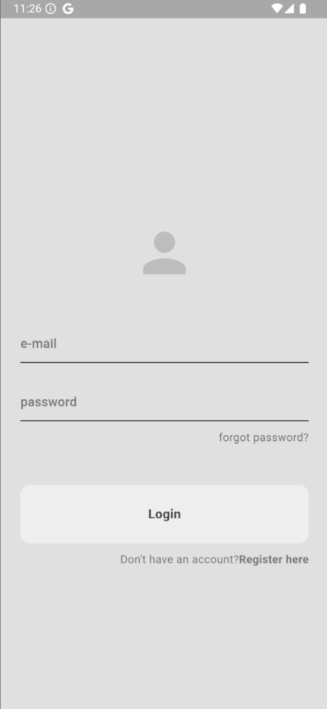
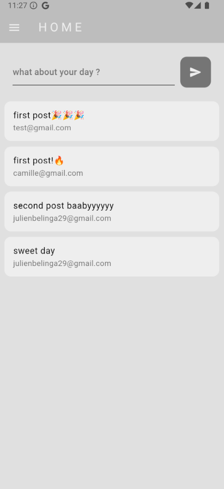
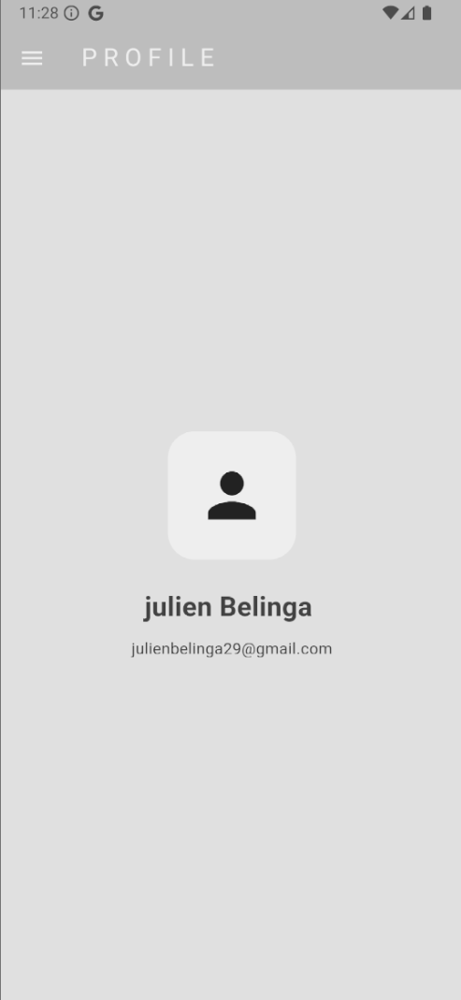
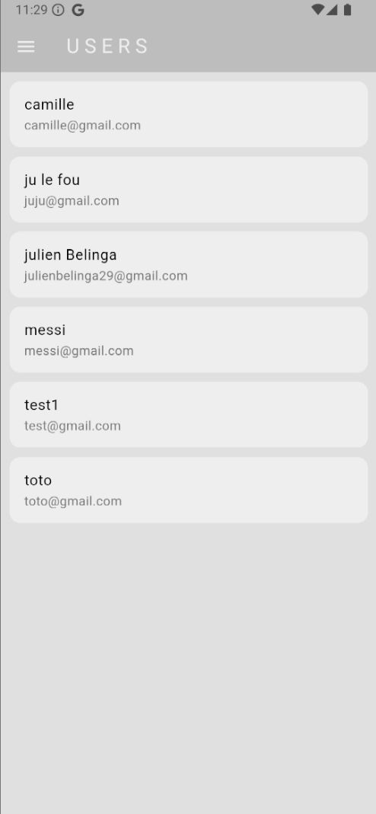

# Mini Social App 🌟

Une application sociale construite avec **Flutter** et **Firebase**. Ce projet est conçu pour améliorer vos compétences en Flutter et apprendre à intégrer des services Firebase dans une application mobile.

## Fonctionnalités 🚀

- **Authentification avec Firebase** : Inscription et connexion d'utilisateurs.
- **Gestion des profils utilisateurs** : Affichage et modification des informations de profil.
- **Flux d'activités** : Publication et affichage des messages.
- **Notifications en temps réel** : Utilisation de Firebase pour des notifications instantanées.

## Capture d'écran 📸

<div style="display: flex; flex-wrap: wrap; gap: 10px;">

  <div style="flex: 1; text-align: center;">
    
    <p>Login Page</p>
  </div>

  <div style="flex: 1; text-align: center;">
    
    <p>Home Page</p>
  </div>

  <div style="flex: 1; text-align: center;">
    
    <p>Profile Page</p>
  </div>

  <div style="flex: 1; text-align: center;">
    
    <p>Users Page</p>
  </div>

</div>


## Installation 🛠️

1. **Clonez le repository** :
   ```bash
   git clone https://github.com/julienBelinga/mini-social-app.git
    ```

2. **Installer les dépendances** :
   ```bash
   flutter pub get
    ```

3. **Configurez Firebase** :
    Suivez les [instructions ici](https://firebase.flutter.dev/docs/overview) et ajoutez vos clés de configuration.

4. **Lancez l'application** :
   ```bash
   flutter run
    ```

## Technologies utilisées 🖥️

- **Flutter** : Framework pour le développement mobile.
- **Firebase** : Authentification, base de données en temps réel, notifications.
- **Dart** : Langage de programmation utilisé avec Flutter.

## Contribuer 🤝

1. **Fork le repository**.
2. **Créez une branche pour votre fonctionnalité** :  
   ```bash
   git checkout -b feature/ma-fonctionnalite
    ```
3. **Commit les changements** :
    ```bash
    git commit -m "Ajoutez une description de votre fonctionnalité"
    ```
4. **Push la branche** :
    ```bash
    git push origin feature/ma-fonctionnalite
    ```
5. **Ouvrez une Pull Request**.

## Auteur 👨‍💻

- **Nom** : Julien Belinga  
- **Email** : julienbelinga29@gmail.com  
- [LinkedIn](https://www.linkedin.com/in/julien-belinga/)


